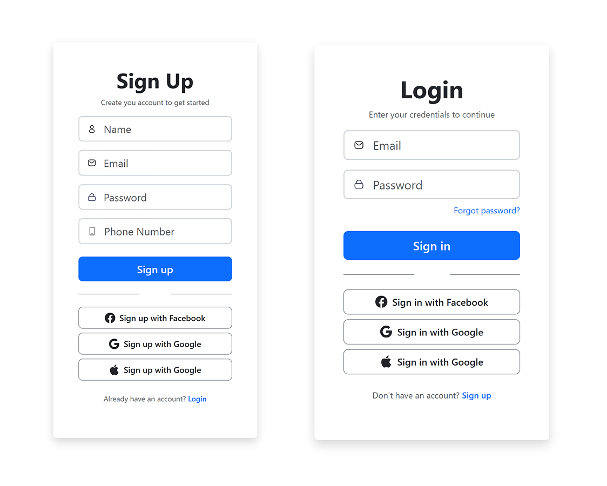

# Day 001 — Sign Up & Login UI

> **Daily UI Challenge #001 – Sign Up**

This is my submission for **Day 001** of the Daily UI Challenge.

The challenge was to design and develop a modern authentication interface. I created both a **Sign Up** page and a **Login** page using **HTML**, **CSS**, and **Bootstrap** while focusing on clean layout, spacing, typography, and responsive design.

---

## 📸 Preview



---

## 🌐 Live Demo

🚀 **Live Website**

https://arpitbreathes.github.io/Daily-UI/Day-001-Login/

---

## ✨ Features

- Modern Sign Up page
- Clean Login page
- Responsive layout
- Bootstrap 5 components
- Custom styled inputs
- Social login buttons
- Password recovery link
- Semantic HTML
- Soft shadows and minimal UI

---

## 🛠️ Tech Stack

- HTML5
- CSS3
- Bootstrap 5
- Font Awesome

---

## 🎯 What I Learned

This was my **first Daily UI Challenge** after learning **HTML**, **CSS**, and **Bootstrap**.

Unlike tutorials where the structure is already provided, this project required me to think through every part of the implementation.

During this project I learned:

- How to plan the HTML structure before writing CSS.
- When Bootstrap utility classes are useful.
- When custom CSS is the better choice.
- How to organize layouts using nested `<div>` elements.
- Building reusable sections.
- Creating consistent spacing and alignment.
- Turning a UI design into a working webpage.

The biggest challenge wasn't writing CSS—it was deciding **which classes to use, where to place elements, and how to organize everything cleanly**.

Although this project took much longer than expected, it greatly improved my understanding of frontend development.

---

## 💭 Challenges Faced

- Structuring the HTML correctly.
- Choosing the right Bootstrap classes.
- Maintaining consistent spacing.
- Matching the design while keeping the code clean.
- Building from a design instead of following a tutorial.

---

## ⏱️ Project Details

| Detail     | Value            |
| ---------- | ---------------- |
| Challenge  | Daily UI #001    |
| Difficulty | ⭐⭐⭐⭐⭐ (5/5) |
| Time Taken | ~5 Hours         |
| Status     | ✅ Completed     |

---

## 📂 Project Structure

```text
Day-001-Login/
│
├── assets/
├── index.html
├── signup.html
├── style.css
├── screenshot.png
└── README.md
```

---

## 🚀 Future Improvements

- JavaScript form validation
- Accessibility improvements
- Dark mode
- Better animations
- Fully responsive mobile version

---

## 📚 Challenge Source

https://www.dailyui.co/

---

## 👨‍💻 Author

**Arpit Pandey**

GitHub: https://github.com/ArpitBreathes

---

## 📈 Progress

- ✅ Day 001 Completed
- ⏳ 99 Challenges Remaining

---

> ### Reflection
>
> This project took me approximately **5 hours** to complete and was quite difficult because it was my first attempt at recreating a UI from scratch.
>
> Throughout the process I learned much more than I expected—not just HTML and CSS, but also how to think about layout, structure, spacing, and overall organization.
>
> I'm excited to continue this challenge and look back at Day 001 after completing all 100 projects to see how much I've improved.
